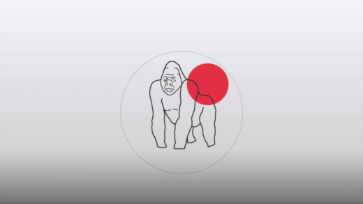

# Security Aptitude Assessment and Analysis

 

The CBAS - SAP Security Aptitude Assessment (CBAS-SSAA) project allows organizations to determine the skill and knowledge gaps required to secure SAP implementations in an organization.

The Security Aptitude Assessment is designed to find these gaps and map them to the [NO MONKEY Security Matrix](NMSM.md).

## Whats In It For Me (WIIFM)

In return, this allows organizations to

 - Prioritize their security efforts in areas that have been identified with a high risk
 - Align and plan SAP security trainings to their teams to increase their knowledge and skills in protecting the SAP environment

## Getting Started

The below video illustrates how you can get started with the Security Aptitude Assessment and Analysis.

The [HOW-TO](HOW_TO.md) file also gives an overview on how to start with your Security Aptitude Assessment and Analysis.

## Contribution

See [CONTRIBUTING](https://github.com/NO-MONKEY/CBAS-SAP/blob/master/CONTRIBUTING.md) section for more information.    

## Leaders
- [Waseem Ajrab](mailto:waseem.ajrab@no-monkey.com)
- [Marco Hammel](mailto:marco.hammel@no-monkey.com)

## Communication channel

Anyone interested in supporting, contributing or giving feedback join us in our discord channel.

* [Discord Channel](https://discord.gg/X8ZVSfH)

## License

 This work is licensed under a <a rel="license" href="http://creativecommons.org/licenses/by-sa/4.0/">Creative Commons Attribution-ShareAlike 4.0 International License</a>.
